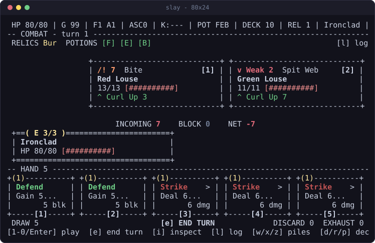
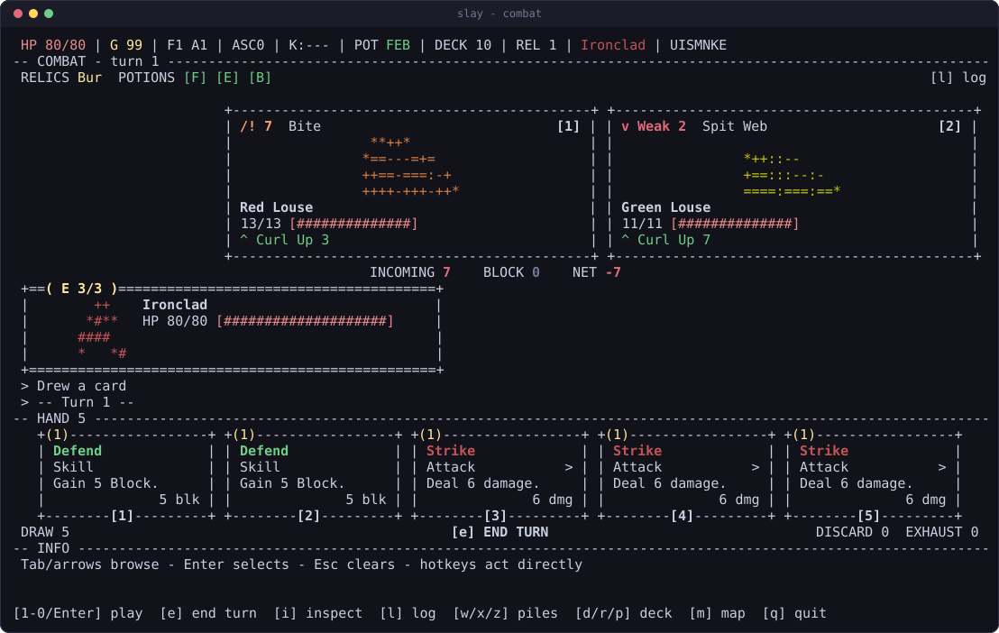
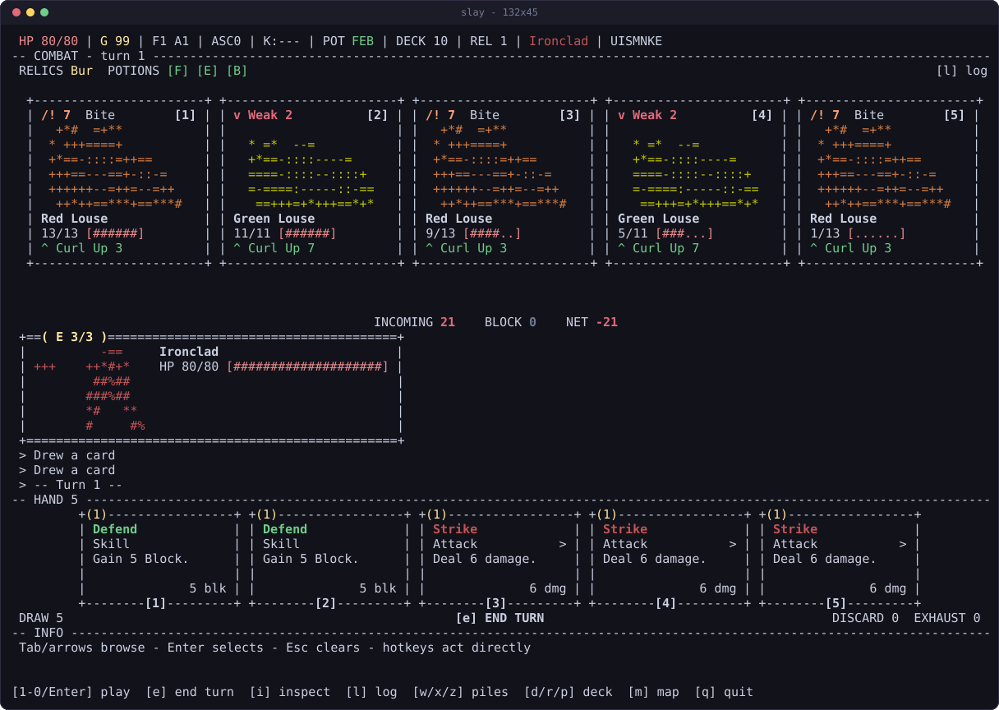
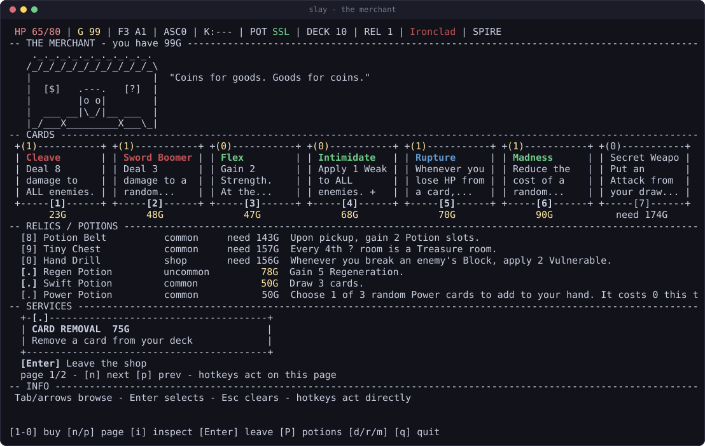

# Playing

Keys, the fluid layout, and where your run is kept.

## Keys

Number keys select, letters act.

| key | does |
| --- | --- |
| `1`-`0` | pick the numbered thing: a card, a reward, a shop item, a path |
| `Enter` | activate whatever the cursor is on |
| `Esc` | clear the cursor, or close the top overlay |
| `Tab` / `Shift-Tab` | move the hover cursor forward and back |
| arrows | move the hover cursor; on the map, scroll and change path |
| `e` | end turn |
| `i` | inspect what the cursor is on, in full |
| `j` / `k` | while inspecting, step to the next and previous thing; arrows work too |
| `l` | combat log |
| `m` | the act map, read-only, from anywhere in a run |
| `d` / `r` / `p` | deck, relics, potions (`p` pages back on multi-page lists) |
| `P` (Shift+P) | carried potions from a run screen, including the merchant |
| `w` / `x` / `z` | draw, discard and exhaust piles |
| `n` / `p` | next and previous page, on any list that has more than one |
| `n` / `c` | new run, continue (on the menu) |
| `a` / `A` | ascension up and down (on the menu); `+` and `-` also work |
| `s` | edit the seed (on the menu) |
| `r` | random seed (on the menu only; does not start a run) |
| `S` | settings, from the menu or from anywhere in a run |
| `q` | quit: instant on the menu, `[y]`/`[n]` confirmation mid-run |
| `Ctrl+C` | quit immediately from anywhere, still safely |

Every screen prints its own key hints along the bottom row, so this table is a
reference rather than something to memorize.

On the menu, `r` replaces the displayed seed with a fresh OS-random 64-bit seed,
formatted by the game's canonical seed helper (uppercase base 35, without `O`).
The control bridge exposes the same **Random seed** control and exact value in
`ui.menu.seed`. Randomizing does not start a run, access saves, or consume any
gameplay RNG; `n` / `Enter` still starts with the seed shown. The seed editor
remains literal: `s` edits a replay seed, and confirming an empty edit keeps the
previous seed. Game-over reruns still use the next seed, not a random one.

Live card costs include cost-changing powers, dynamic costs, and free-to-play
effects. The hand, inspect/pile views, and control bridge use the engine's same
cost calculation; for example, Corruption skills show zero and remain selectable
at zero energy. Previewing costs never consumes gameplay RNG or changes the run.

Hand selection and the control bridge's `combat.hand[].playable` also check the
engine's card-use conditions and power/relic vetoes, not just energy. Clash needs
an all-Attack hand, Signature Move must be the only Attack, and Grand Finale needs
an empty draw pile. A condition-blocked card is disabled even when its cost is
zero. These checks run on cloned state without playing cards, consuming RNG, or
revealing draw order.

The hover cursor is read-only: moving it never commits anything. Whatever it
points at is explained in the INFO panel at the bottom. On menus and lists the
cursor doubles as the selection, so `Enter` activates it and `Esc` clears it.

## Vim keys

Off by default. `S` opens settings from the menu or from anywhere in a run, and
`Enter` or `[1]` flips them. The answer is kept in `prefs.json`, so it survives
quitting.

With them on, `h` `j` `k` `l` are the arrow keys on every screen: they move the
hover cursor, choose between paths on the map, and step through an inspected
collection. Exactly one thing has to move out of the way, the combat log, which
answers to `L` instead. Every other letter keeps its job: `e` end turn, `i`
inspect, `d` `r` `p` deck, relics and potions, `w` `x` `z` piles.

Two things deliberately do not change. `j` and `k` already stepped through
inspected cards and scrolled the map, so they mean the same thing either way.
And typing a seed is still typing, so `s` then `hjkl` spells HJKL.

Whichever way the setting sits, the hint line along the bottom prints the keys
that are actually live, so a fight reads `[L] log` under vim bindings and
`[l] log` without them.


`m` opens the act map over whatever room you are standing in: a shop, a
campfire, a fight. It is read-only, so it answers "what is coming" without
letting you leave the room you are in. `up`/`down` scroll it, `Esc` or `m`
again puts it away.

## Nothing is hidden from you

`i` opens whatever the cursor is on at full size: any card, any relic, any
potion, from any screen. The merchant's stock, a card in your draw pile, a
reward you have not taken, a card the smith is about to upgrade, the relics you
are already carrying. Card boxes are narrow and the INFO panel is short, so both
cut long text; `i` is the copy that never does.


A card shows both of its states side by side, captioned: unupgraded on the left,
upgraded on the right, the one you are actually holding in full color and the
other dim. So the smith, the merchant and every card reward answer "what does
the `+` buy me" before you spend anything.

It also explains itself. Under the rules text, every keyword the item names gets
a one-line definition, so you do not have to already know what Vulnerable,
Plated Armor or Evoke do. `j` and `k` walk the rest of the collection without
closing the box, and `Enter` still does the obvious thing: play the card, take
the reward, buy the item, drink the potion. `Esc` puts you back exactly where
you were, list and page intact.

## The layout is fluid

The game uses every column and row you give it, and degrades in steps rather
than clipping.

**At 80x24**, the minimum, every screen compacts to dense one-liners. Nothing
important is dropped, it just gets terser.



**At 120x36 and up**, enemy panels, card-shaped boxes, scene art and the bottom
INFO panel appear, and every monster and your hero are drawn as ASCII portraits
inside their panels, each creature tinted with the average color of its own
sprite.



**At 132x45**, a crowded room still gives all five monsters a full portrait, and
the cards in hand grow taller.



Resizing mid-run is fine. The frame is recomputed from the terminal's current
size on every repaint, and the layout math is clamped at every size, so there is
no size that breaks it.

## Reading a fight

Cards print what they will really do, not what they were printed with. The last
row of every card box carries the live number: `9 dmg` on a Strike under
Strength 3, `3 blk` on a Defend under Frail, `5 dmg x2` on Twin Strike. It goes
green when a power raised it and red when Weak or Frail cut it, so a bad turn is
visible before you commit to it. Aiming a card prices every enemy in the
targeting strip (`[1] Cultist (9)`), which is where Vulnerable shows up.

Between the enemies and your panel, one line says how the turn ends:

```
INCOMING 16    BLOCK 5    NET -11
```

That is every living attacker's damage added up against the block you are
holding, in one place, because they used to sit at opposite ends of the screen.

Looter and Mugger's Mug/Lunge intents include live damage and the gold they can
steal, without executing their effects or rolling their cosmetic dialog RNG.
Theft reads "up to" because another thief may act first. The control bridge uses
the same preview; Runic Dome still hides it. Genuinely unknown effects remain
marked as partial.

The header carries a potion slot per character, always: `POT F-B` is a Fire
Potion, an empty slot and a Block Potion. The log names the card that was
played, including the ones you did not choose: `Havoc plays Immolate`.

## Screens

**The map** scrolls, remembers where you have been, and carries a legend for
every glyph.


**The merchant** pages through cards, relics, potions and card removal, with
prices and what you cannot yet afford. Unaffordable purchases and removal are
disabled in the numbered list and control bridge; inspecting an item does not
bypass its price. Sold stock and used removal stay disabled.

`n` / `p` still page forward / back. `P` (Shift+P) opens your carried potions
without leaving the merchant: select a potion, then `d` to discard it. `Esc`
closes the top overlay and returns to the same shop page. Lowercase `p` still
opens potions on run screens without pagination.



## Saves

The run is written to `~/.slay-the-cli/save.json` after **every action**, so
quitting is always safe: `q` and Ctrl+C both exit cleanly, and `c` on the menu
resumes exactly where you left off. There is no save slot to manage and no
confirmation to sit through.

`prefs.json` beside it remembers your last character, seed, ascension, color
setting and whether vim keys are on, so the menu comes back the way you left it.

`SLAY_DIR` moves both files elsewhere. See
[INSTALL.md](INSTALL.md#where-things-live) for the full layout, and its
[troubleshooting section](INSTALL.md#troubleshooting) if a run seems to have
gone missing.

## Color

Color is on by default and uses xterm-256. `--no-color` or `NO_COLOR=1` gives
plain output, which is also what you get when the output is not a terminal.
Every frame is pure ASCII underneath, so the game is readable either way.

Color carries meaning rather than decoration. Map nodes wear their room: green
rest, blue merchant, gold treasure, red elite, purple unknown, and bold for the
rooms you can actually walk to. Cards wear their type: red attacks, green
skills, blue powers. Nothing depends on it, and the legend spells out every
glyph anyway.

## Opt-in local control

The running terminal app can serve a local controller without terminal
keystroke injection or reading save files. The terminal stays visible and
human input still works. Both inputs use the same action dispatcher, engine
advance, save and paint path.

Set `SLAY_CONTROL_SOCKET` before starting the app, for example:

```sh
mkdir -m 700 "$HOME/.slay-control"
SLAY_CONTROL_SOCKET="$HOME/.slay-control/live.sock" npm start
```

The path must be absolute, normalized, and at most 103 bytes. The parent
directory must be owned by your user, private (0700), and not reached through
symlinks. A missing immediate parent is created with mode 0700. The socket
uses mode 0600; no TCP listener is opened. Existing files or sockets are
never replaced. A stale socket after an unclean exit must be removed manually
after checking that its app is no longer running. Normal exit removes the
socket. Leave the environment variable unset to disable control entirely.

### HTTP over the Unix socket

`GET /state` returns:

```json
{
  "revision": "app-epoch:sequence",
  "state": null,
  "ui": {
    "mode": "menu",
    "screen": "menu",
    "overlay": null,
    "focus": [],
    "selected": [],
    "controls": [],
    "running": true
  },
  "screenText": "plain terminal frame"
}
```

`state` is the live, public game state, or null before a run exists. It includes
the full public deck and map, the current hand's card IIDs, costs and upgrades,
visible powers, living enemies and current intents, pile counts, and compact
pile card labels. Draw-pile labels are sorted with order hidden unless Frozen
Eye is owned; discard and exhaust labels stay in pile order. It never serializes
RNG, future rewards, encounter pools, enemy scratch data or pending
continuations. Pending choices disclose the cards on their current visible page.
Runic Dome hides intents here too.
Event screens and `room.eventView.body` include current public feedback. Match
and Keep shows attempts left and previously revealed pairs, including after a
mismatch turns both cards face-down. Reveal history is scoped to the current
room and comes from public event messages, never the hidden board or card pool.
After reopening a run, only reveal feedback still present in its latest event
message can be recovered; earlier UI-only history is not reconstructed.
The live game-over state remains available after the save is deleted; `ui`
distinguishes a retained run from the menu currently being shown.

`ui` reports the actual overlay, current page, focused/selected control IDs,
menu seed entry, targeting and toast. Each control has `id`, optional `key`,
`label`, `enabled`, `selected`, and `focused`. IDs describe action and object
identity, not labels or filtered list positions. Treat IDs as opaque and
always pair them with the revision that supplied them.

`screenText` is an ASCII, color-free render at the terminal's current size.
Unopened chest contents are deliberately redacted even when the human terminal
shows them. Pile card overlays are visible through the bridge, with draw order
hidden unless Frozen Eye is owned. Navigation still reports the actual overlay,
page and focus.

`POST /act` accepts exactly one action:

```json
{
  "requestId": "unique-client-request",
  "expectedRevision": "revision-from-state",
  "action": { "kind": "select", "id": "opaque-control-id" }
}
```

The action forms are:

| action | behavior |
| --- | --- |
| `{"kind":"select","id":"..."}` | activate that exact current, enabled control |
| `{"kind":"play","iid":123,"target":2}` | play that visible hand card against living enemy slot 2 |
| `{"kind":"end"}` | end the current unobstructed combat turn |
| `{"kind":"key","key":"TAB"}` | apply one current UI navigation key or printable hotkey |

`target` is the current public enemy's **1-based slot**, not an engine index.
It is required for targeted cards with multiple living enemies, optional
when there is only one, and forbidden for untargeted cards. `play` and `end`
reject while a menu, overlay, choice or targeting picker is active.

Named keys are `UP`, `DOWN`, `LEFT`, `RIGHT`, `ENTER`, `ESC`, `TAB`,
`SHIFT_TAB`, and `BACKSPACE`. Single printable ASCII characters are accepted
as current hotkeys or seed-entry characters. Arbitrary engine commands,
settings changes, file access, shell commands, text pastes and control bytes
are not operations of this API.

Responses contain `ok`, `changed`, optional `error`, `beforeRevision`, and
the complete resulting snapshot. `outcome` distinguishes `rejected`,
`ui-only`, `applied`, and `applied-save-failed`: a revision or toast alone
does not establish that a game action ran. A paint failure is additionally
reported as `paintError`, without losing the underlying action outcome.
The app uses checked run persistence, so a filesystem write or save-deletion
failure returns `applied-save-failed` with the advanced live state rather than
silently reporting success. The human terminal receives the same error toast.
Dispatched actions also include
`verification` with their resolved identity, requested action, and before/after
public deck. Successful `select` means the resolved action was dispatched,
not merely that a key was delivered. Some selections navigate, focus or
toggle a candidate rather than commit it; inspect the resulting UI and state.
An error can have `changed:true` (for example, a save or paint failure after
an engine advance). Always inspect the returned snapshot.

Revision checks and actions are atomic within the live event loop. Human
input, UI-only navigation and terminal resizes update revisions; restarting
the app changes its epoch. Stale revisions, missing IDs and disabled options
reject instead of guessing.

Retry a lost response with the **same request ID and identical payload**.
The response is replayed without another action, even after later input.
Reusing the ID with a different payload rejects. The journal retains up to
1024 responses or 32 MiB (plus the last response); it never evicts entries
to make an old ID executable again. Once full, new IDs reject until the app
is restarted into a new epoch. Failed valid requests are retained too.

Requests are limited to 8 KiB, headers to 8 KiB, and connections to eight.
Malformed JSON receives HTTP 400, oversized input 413, unknown routes 404,
and action rejection 409. Action errors include the current snapshot.
There are no runtime dependencies beyond the Node-compatible standard
library; Bun and Node with `tsx` use the same bridge.
